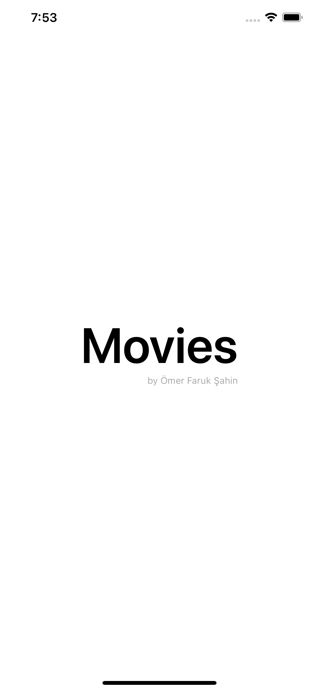
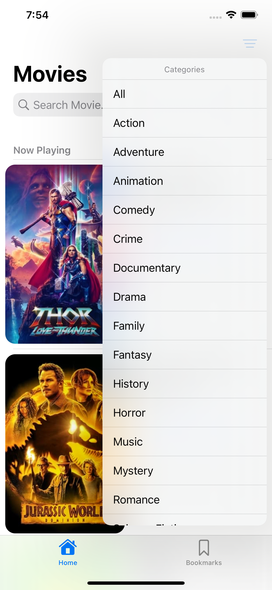
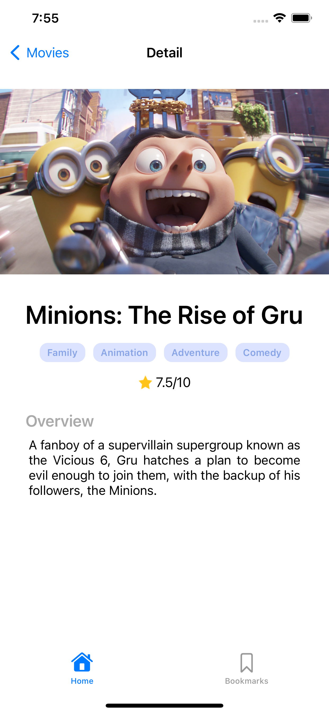
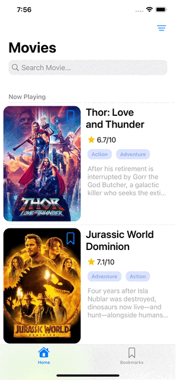

# **Movies-App**
- A four-paged movie list app
- The first appearing screen is the splash screen
- The data is fetched from the [TMDb API](https://developers.themoviedb.org/3/getting-started/introduction)
- The first screen inside the app lists all of the movies with different sections(endpoints) and supporting search and filter 
- Search by the name of the movie and filter by the category
- By tapping one of the movies, the movie detail screen appears
- Can able to add the movie into the bookmarks via bookmark button
- The last screen is the bookmarks which have the bookmarked movies
 

| Splash Screen  | List | Category | 
| ------------- | ------------- | ------------- |
|  |   |   |

| Search  | Detail | 
| ------------- | ------------- |
|  |  | 

# **How It Works?**
- Bookmark or delete from bookmarks any movie with bookmark button on the right corner of the movie poster
- If a movie exists more than one section it bookmarks automatically all of the occurences of that movie 
- Can use tab bar to see all bookmarked movies
- Can see detail page with selecting specified row
 

| Bookmark  | Searching | Filtering  | Bookmark All |
| ------------- | ------------- | ------------- | ------------- |
|  |   |   |   |

# **Technical Keywords**
- MVVM
- Table view
- Codable
- SPM
- SnapKit
- Kingfisher
- Generic network layer
- Delegation
- Closures
- URLSession
- Singleton
- UserDefaults
